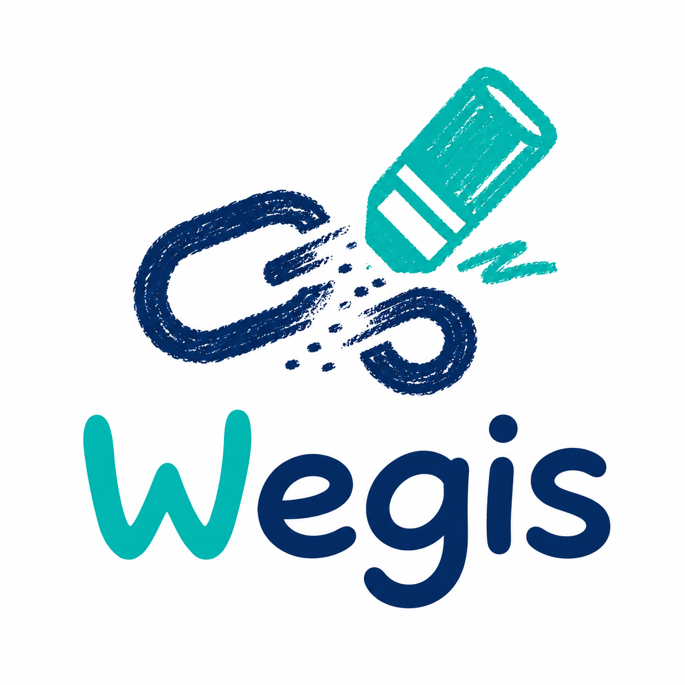

    

<em><b>Wegis:</b> Guarding Every Link, Every Time</em>

---

A Chrome extension that detects and blocks phishing, QR phishing, shortened links, and risky downloads in real time while you browse.

## Key Features

- dangerous links are visually scribbled out on the page, QR codes are crossed out
- Blocking dangerous link access with warning notifications
- QR phishing, shortened link, and redirected URL protection
- Risky download checks with browser notifications
- Real-time link phishing site monitoring for dynamically changing pages

## Quick Start

### Browser Support

| Browser                       | Status            | Notes                                                                                      |
| ----------------------------- | ----------------- | ------------------------------------------------------------------------------------------ |
| Google Chrome, latest stable  | Supported         | Primary target browser.                                                                    |
| Microsoft Edge, latest stable | Compatible        | Chromium-based; manually tested by loading the unpacked extension.                         |
| Brave, Vivaldi, Arc, Opera    | Best effort       | May work if Chrome extension APIs are available, but not part of the official test matrix. |
| Firefox                       | Not supported yet | Requires browser-specific Manifest V3 and background-script compatibility work.            |
| Safari                        | Not supported yet | Requires Safari Web Extension conversion and separate validation.                          |
| Mobile browsers               | Not supported     | Wegis requires a desktop browser extension environment.                                    |

### Official Installation

official download link will be provided later.

### Manual Installation

1. Download this repository from GitHub with **Code > Download ZIP**, or clone it with Git.
2. If you downloaded a ZIP file, unzip it.
3. Open Chrome and go to `chrome://extensions/`.
4. Enable **Developer mode** in the top-right corner.
5. Click **Load unpacked** and select the project root folder that contains `manifest.json`.
6. Confirm that **Wegis** appears in the extension list and is enabled.

## Technology Stack

- **Manifest Version**: 3
- **Languages**: JavaScript (ES2022), HTML5, CSS3
- **API**: [Wegis Server API](https://github.com/bnbong/Wegis_server)
- **AI**: **mobileBERT + CNN multimodal model** for phishing detection
- **Permissions**: activeTab, declarativeNetRequest, storage, downloads, notifications, host permissions
- **External Libraries**: jsQR (QR code decoding)

## Usage

- Wegis automatically scans links, QR codes, shortened links, and risky downloads while you browse.
- Click the Wegis toolbar icon to view status and quick settings.
- Open the extension options page to adjust protection, warnings, QR scanning, download checks, cache time, API delay, and the whitelist.

## Contributing

Development setup and project checks are documented in
[CONTRIBUTING.md](CONTRIBUTING.md).
